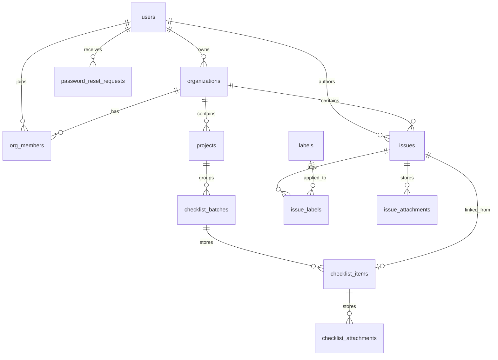

# Schema Overview

## Bootstrap order

The database bootstrap order documented in `infra/database/README.md` is:

1. `infra/database/schema.sql`
2. `infra/database/seed_reference_data.sql`
3. `infra/database/seed_admin.sql`

Optional demo data is imported after those files with `infra/database/demo.sql`.

## Entity map

- `users`: application accounts with a system-level role and an optional last active organization.
- `password_reset_requests`: email OTP challenges for password recovery.
- `organizations`: tenant-like grouping for issues and membership.
- `org_members`: membership bridge between users and organizations, including organization-specific roles.
- `labels`: global label catalog seeded from reference data.
- `issues`: core issue record plus workflow assignees and workflow timestamps.
- `projects`: organization-scoped project catalog for checklist work.
- `checklist_batches`: parent records for manual or bot-generated checklist runs.
- `checklist_items`: child checklist rows under a batch, including assignment and issue linkage.
- `checklist_attachments`: uploaded files linked to checklist items.
- `issue_labels`: many-to-many bridge between issues and labels.
- `issue_attachments`: uploaded files linked to issues.
- `contact`: standalone contact-message table present in the schema.

## Relationships

Compact relationship map:

- `organizations.owner_id -> users.id`
- `password_reset_requests.user_id -> users.id`
- `org_members.org_id -> organizations.id`
- `projects.org_id -> organizations.id`
- `checklist_batches.project_id -> projects.id`
- `checklist_items.batch_id -> checklist_batches.id`
- `checklist_items.issue_id -> issues.id`
- `checklist_attachments.checklist_item_id -> checklist_items.id`
- `org_members.user_id -> users.id`
- `issues.author_id -> users.id`
- `issues.org_id -> organizations.id`
- `issue_labels.issue_id -> issues.id`
- `issue_labels.label_id -> labels.id`
- `issue_attachments.issue_id -> issues.id`

## Current model notes

- System role and organization role are separate concepts. `users.role` controls app-level access, while `org_members.role` controls organization workflow permissions.
- Password recovery state is tracked in `password_reset_requests`, not on the `users` row itself.
- Labels are global reference data. They are seeded once and are not scoped to an organization.
- Issue workflow state is split across `issues.status` and `issues.assign_status`.
- The issue workflow also depends on several nullable assignee columns in `issues` rather than a normalized workflow history model.
- Checklist management is organization-scoped and project-backed, with one batch containing many checklist items.
- Checklist items can create and link to a regular `issues` row when they fail or become blocked.
